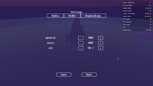
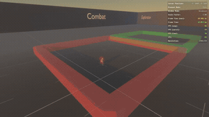

# 3D Bevy game template




This template is based on the awesome [BevyFlock 2D template][BevyFlock] featuring out of the box builds for:
- Windows
- Linux
- macOS
- Web (Wasm)
This template is a great way to get started if you aim to build new 3D RPG [Bevy] game!
It is not as simple as bevy_new_2d which is aimed to an easy start and no dependencies.
It focuses instead to a rather solid starting template with some basic bells and whistles to be able to carry the weight of big projects and tries to follow the [flat architercture](#project-structure) principle.
Start with a [basic project](#write-your-game) and [CI / CD](#release-your-game) that can deploy to [itch.io](https://itch.io).
You can [try this template in your browser!](https://olekspickle.itch.io/bevy-3d-rpg)

## Best way to start
Install [cargo-generate] or [bevy_cli] and run:
```bash
cargo generate olekspickle/bevy_new_3d_rpg -n my-3d-game
# or with bevy_cli
bevy new -t=olekspickle/bevy_new_3d_rpg my-3d-game
```

### Hotpatching
To set this up, follow the instructions in the [release announcement](https://bevy.org/news/bevy-0-17/#hot-patching-systems-in-a-running-app)
- Linux: `makers hot` or `cargo make hot` or `bash BEVY_ASSET_ROOT="." dx serve --hot-patch`
- Windows PS:`$env:BEVY_ASSET_ROOT="." ; dx serve --hot-patch`

## Features:
- [x] flat cargo project structure for game logic crates that can grow and be maintainable
- [x] import and usage of game mechanics and parameters from .ron (config, credits) (kudos to Caudiciform)
- [x] simple asset loading based on [bevy_asset_loader] with loading from path addition (kudos to Caudiciform)
- [x] third person camera with [bevy_third_person_camera]
- [x] top down camera with [bevy_top_down_camera]
- [x] solid keyboard & gamepad mapping to ui & game actions using [bevy_enhanced_input]
- [x] simple scene with colliders and rigid bodies using [avian3d]
- [x] kinematic character controller using [bevy_ahoy] adapted to third person
- [x] simple skybox sun cycle using [bevy atmosphere example], with daynight and nimbus modes
- [x] featuring rig and animations using [Universal Animation Library] from quaternius
- [x] experimental sound with [bevy_seedling] based on Firewheel audio engine (which will probably be upstreamed), with improved audio for web
- [x] different music(exploration, combat) on zone change event with music crossfade and playback tracking
- [x] setup for playing music from a list of tracks with deterministic never repeating playback (thx [bevy_shuffle_bag])
- [x] consistent Esc back navigation in gameplay and menu via stacked modals (kudos for the idea to skyemakesgames)
- [x] serialize and save settings
- [x] audio, video and keys rebind tabs in settings (currently broken)
- [x] easy drop in scene integration using awesome [skein] with a simple scene
- [x] custom font replace example using pre-loaded font

### TODOs
- [ ] simple animation transition state machine
- [ ] 3d and 2d particles demo: shooting magic balls, fireplace, step dust
- [ ] spatial audio demo: boombox emitting background music
- [ ] modern PS/SteamDeck like item select wheel
- [ ] small door/portal demo
- [ ] pool with light textures
- [ ] split screen for local coop
- [ ] flying around suit/mode
- [ ] vault on objects if they are reachable
- [ ] climbing
- [ ] basic fighting: punch, kick, take weapon
- [ ] rifle
- [ ] bow

## Run your game

There are some helpful commands in [Makefile](./Makefile) to simplify build options
But generally running your game locally is very simple:

<details>
    <summary><ins>with bevy_cli</ins></summary>

- Dev: `bevy run` to run a native dev build
- Release: `bevy run --release` to run a native release build
- Use `bevy run --release web` to run a web release build
To run a **web** dev build to run audio in separate thread to avoid audio stuttering:
- :`bash bevy run web --headers="Cross-Origin-Opener-Policy:same-origin" --headers="Cross-Origin-Embedder-Policy:credentialless" `
</details>

<details>
    <summary><ins>with cargo-make</ins></summary>

- Install [cargo-make]: `cargo install cargo-make`

- Dev: `makers run` or `cargo make run` to run a **native** dev build
- Release: `makers build` or `cargo make build` to build a **native** release build
- Web: `makers run-web` or `cargo make run-web` to run a **web** dev build to run audio in separate thread to avoid audio stuttering
</details>

<details>
<summary><ins>Installing Linux dependencies</ins></summary>

  If you're using Linux, make sure you've installed Bevy's [Linux dependencies].
  Note that this template enables Wayland support, which requires additional dependencies as detailed in the link above.
  Wayland is activated by using the `bevy/wayland` feature in the [`Cargo.toml`](./Cargo.toml).
</details>

<details>
<summary><ins>(Optional) Improving compile times</ins></summary>

[`.cargo/config.toml`](./.cargo/config.toml) contains documentation on how to set up your environment to improve compile times.
</details>

WARNING: if you work in a private repository, please be aware that macOS and Windows runners cost more build minutes.
**For public repositories the workflow runners are free!**

## Release your game

This template uses [GitHub workflows] to run tests and build releases.
Check the [release-flow](.github/workflows/release.yaml)

## Credits

The [assets](./assets) in this repository are all either by me or CC0 3rd-party.
See the [credits](assets/credits.json) for more information.

## License

The source code in this repository is licensed under any of the following at your option:
- [CC0-1.0 License](./LICENSE-CC0)
- [MIT License](./LICENSE-MIT)
- [Apache License, Version 2.0](./LICENSE-APACHE)

## Bevy Compatibility

| bevy | bevy_new_3d_rpg  |
| ---- | ---------------------- |
| 0.18 |       0.18.*           |
| 0.17 |       0.2.*            |
| 0.16 |       0.1.4            |

[avian3d]: https://github.com/Jondolf/avian/tree/main/crates/avian3d
[bevy]: https://bevyengine.org/
[bevy atmosphere example]: https://bevyengine.org/examples/3d-rendering/atmosphere/
[bevy-discord]: https://discord.gg/bevy
[bevy_asset_loader]: https://github.com/NiklasEi/bevy_asset_loader
[bevy_cli]: https://github.com/TheBevyFlock/bevy_cli
[bevy-learn]: https://bevyengine.org/learn/
[bevy_seedling]: https://github.com/CorvusPrudens/bevy_seedling
[bevy_third_person_camera]: https://github.com/The-DevBlog/bevy_third_person_camera
[bevy_top_down_camera]: https://github.com/olekspickle/bevy_top_down_camera
[bevy_ahoy]: https://github.com/jannhohenheim/bevy_ahoy
[bevy_shuffle_bag]: https://github.com/jannhohenheim/bevy_shuffle_bag
[Bevy Cheat Book]: https://bevy-cheatbook.github.io/introduction.html
[BevyFlock]: https://github.com/TheBevyFlock/bevy_new_2d
[bevy_enhanced_input]: https://github.com/projectharmonia/bevy_enhanced_input
[cargo-generate]: https://github.com/cargo-generate/cargo-generate
[cargo-make]: https://github.com/sagiegurari/cargo-make
[GitHub workflows]: https://docs.github.com/en/actions/using-workflows
[Linux dependencies]: https://github.com/bevyengine/bevy/blob/main/docs/linux_dependencies.md
[skein]: https://bevyskein.dev
[trunk]: https://trunkrs.dev/
[Universal Animation Library]: https://quaternius.itch.io/universal-animation-library

[spawn the Window hidden]: https://github.com/bevyengine/bevy/blob/release-0.14.0/examples/window/window_settings.rs#L29-L32
[make it visible a few frames later]: https://github.com/bevyengine/bevy/blob/release-0.14.0/examples/window/window_settings.rs#L56-L64
[`physics_in_fixed_timestep`]: https://github.com/bevyengine/bevy/blob/main/examples/movement/physics_in_fixed_timestep.rs
[`smooth_nudge`]: https://github.com/bevyengine/bevy/blob/main/examples/movement/smooth_follow.rs#L127-L142
[load at the start of the game]: https://github.com/rparrett/bevy_pipelines_ready/blob/main/src/lib.rs
